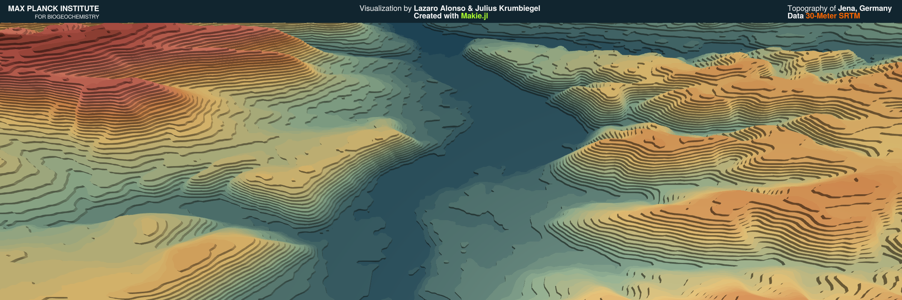

# LittlePieces
Little pieces of code / Little pieces of...

## Fuji-san

---

   

---

## Global temperature anomalies

   

Data: t2m-ERA5: ECMWCF

---
## Topography of Jena, Germany

   

Data: 30-Meter SRTM