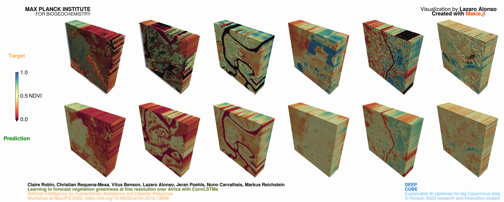

# LittlePieces
Little pieces of code / Little pieces of...

## Fuji-san

---

   

---

## Global temperature anomalies

   

Data: t2m-ERA5: ECMWCF

---
## Topography of Jena, Germany

   

Data: 30-Meter SRTM

---
## Forecast vegetation greenness at fine resolution over Africa

   

---

## Global snowfall

   

---

## Ozone hole

   

> Created using `ozone_layer_SSH.jl`

Interesting links and inspiration:
- https://atmosphere.copernicus.eu/monitoring-ozone-layer
- https://www.unep.org/news-and-stories/story/rebuilding-ozone-layer-how-world-came-together-ultimate-repair-job
- https://www.youtube.com/watch?v=SDPxBZSXxpE

---